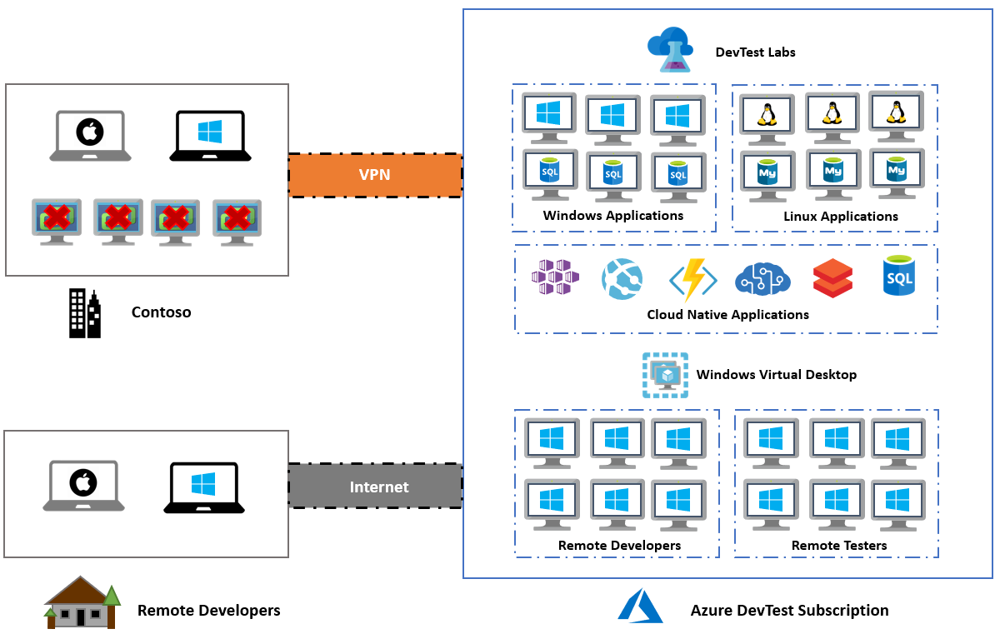
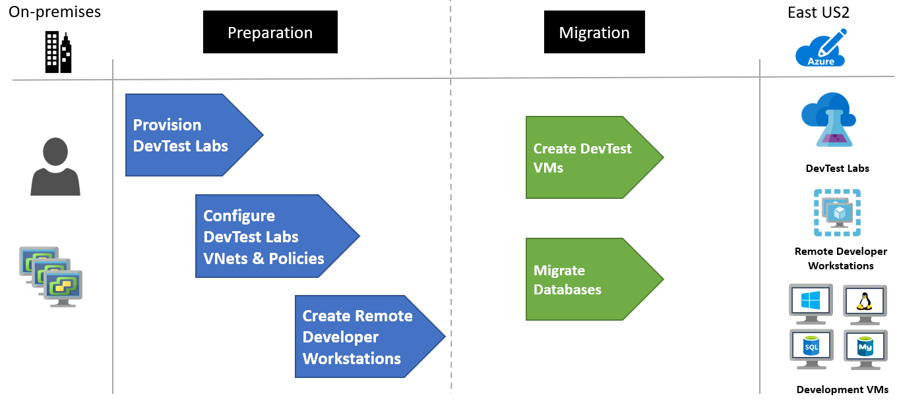

<!-- cSpell:ignore deltadan VMware contoso contoso's host vcenter contosodc NSGs agentless -->

# Moving DevTest to Azure using DevTest Labs (Scenario)
This article demonstrates how the fictional company Contoso moves their DevTest environment to Azure using DevTest Labs.

## Migration Options

Contoso has several options available when moving DevTest to Azure.

**Migration Options** | **Outcome**
--- | ---
[**Azure Migrate**](https://azure.microsoft.com/services/azure-migrate/) | [Assess](https://docs.microsoft.com/azure/migrate/tutorial-assess-vmware) and [migrate](https://docs.microsoft.com/azure/migrate/tutorial-migrate-vmware) on-premises VMs.  Run DevTest Servers using Azure IaaS.    Manage VMs with [Azure Resource Manager](https://azure.microsoft.com/features/resource-manager/).
[**Azure DevTest Labs**](https://azure.microsoft.com/services/devtest-lab/) | Quickly provision development and test environments   Minimize waste with quotas and policies   Set automated shutdowns to minimize costs   Build Windows and Linux environments

> [NOTE]:
> This article focuses on using the Azure DevTest Labs service, to move an on-premises DevTest environment to Azure. Read how Contoso moved [DevTest to Azure using IaaS](./dt-to-labs.md) using Azure Migrate.

## Business drivers

The Development Leadership team has outlined what they want to achieve with this migration:

- Empower developers with access to DevOps tools and self service environments.
- Access to DevOps tools for CI/CD pipelines and cloud native tools for DevTest such as AI, Machine Learning and Serverless. 
- Ensure governance and compliance in DevTest environments.
- Save costs by moving all DevTest environments out of their data center, and no longer purchase hardware to develop software.

> ![NOTE]
> Contoso will leverage the Pay-As-You-Go [Dev/Test subscription offer](https://azure.microsoft.com/offers/ms-azr-0023p/) for their environments. Each active Visual Studio subscriber on their team can use the Microsoft software included with their subscription on Azure Virtual Machines for DevTest at no extra charge. Contoso will just pay the Linux rate for VMs they run, even VMs with SQL Server, SharePoint Server, or other software that is normally billed at a higher rate. 

## Migration goals

The Contoso development team has pinned down goals for this migration. These goals are used to determine the best migration method:

- Quickly provision development and test environments. It should take minutes not months to build the infrastructure a developer needs to write or test software.
- After migration, Contoso's DevTest environment in Azure should have enhanced capabilities over the current system on-premises.
- The operations model will move from IT provisioned VMs to DevOps with self-service provisioning.
- Contoso wants to quickly move out of their on-premises DevTest environments.
- All Developers to connect to DevTest environments remotely, but in a secure manor.

## Solution design

After pinning down goals and requirements, Contoso designs and reviews a deployment solution, including the Azure services they will use for DevTest.

### Current architecture

- The DevTest VMs for Contoso's applications are running on VMware in their on-premises data center.
- These VMs are used for development and testing prior to code being promoted to the production VMs.
- Developers maintain their own workstations, but need new solutions for connecting remotely since many of them are working from home.

### Proposed architecture

- Contoso will use a [DevTest subscription](https://azure.microsoft.com/offers/ms-azr-0023p/) to save costs on Azure resources. This subscription offers significant savings including VMs are don't incur licensing fees for Microsoft software.
- Azure DevTest Labs will be used for managing the DevTest environments. New VMs will be created in the DevTest Labs in support of their move to new tools for Development in the cloud.
- The on-premises DevTest VMs in the Contoso data-center will be decommissioned after the migration is done.
- Developers and Testers will have access to Windows Virtual Desktop for their workstations.

### Database considerations

To support ongoing development Contoso has decided to continue use VMs, but the current VMs will be replaced with new ones running in DevTest Labs. In the future, Contoso will pursue the use of PaaS services such as [Azure SQL Database](https://azure.microsoft.com/services/sql-database/) and [Azure Database for MySQL](https://azure.microsoft.com/services/mysql/).

- Current Database VMs will be decommissioned and replaced with VMs in DevTest Labs.  The existing databases will be migrated with simple backups and restores.
- With the use of the Azure Dev/Test subscription offer, the Windows and SQL Servers will not incur licensing fees which will keep the compute costs to a minimum.

### Solution review

Contoso evaluates the proposed design by putting together a pros and cons list.

<!-- markdownlint-disable MD033 -->

**Consideration** | **Details**
--- | ---
**Pros** | All of the current development VMs (application and database) will be replaced by new VMs running in Azure DevTest Labs. This means they can take advantage of the features of a purpose build cloud development environment.   Contoso can take advantage of their investment in the Dev/Test subscription to save on licensing fees.   Contoso will retain full control of the app VMs in Azure.  Developers will be provided with rights to the subscription which empowers them to create new resources without waiting for IT to respond to their requests
**Cons** | The migration will only move development to the cloud, but since they are still using VMs they won't be using using PaaS Services in their development. This means that Contoso will need have to start supporting the operations of their VMs including security patches. This was maintained by IT in the past, so they will need to find a solution to this new operational task.

<!-- markdownlint-enable MD033 -->

### Migration process

Contoso will migrate their development front-end and databases to new Azure VMs using Azure DevTest Labs.

- They already have the [Azure infrastructure](./contoso-migration-infrastructure.md) in place, including their Development virtual network.
- With everything prepared, Contoso provisions and configures DevTest Labs.
- Configure the Development virtual network, assign a resource group and set polices.
- Create Windows Virtual Desktops for developers to use remote locations.
- Create VMs within DevTest Labs for development.

## Prerequisites

Here's what Contoso needs to run this scenario.

<!-- markdownlint-disable MD033 -->

**Requirements** | **Details**
--- | ---
**Azure Dev/Test subscription** | Contoso creates a [DevTest subscription](https://azure.microsoft.com/offers/ms-azr-0023p/) to take advantage of up to 80% reduction in costs.   If you don't have an Azure subscription, create a [free account](https://azure.microsoft.com/pricing/free-trial).   If you create a free account, you're the administrator of your subscription and can perform all actions.   If you use an existing subscription and you're not the administrator, you need to work with the admin to assign you Owner or Contributor permissions.   If you need more granular permissions, review [this article](https://docs.microsoft.com/azure/site-recovery/site-recovery-role-based-linked-access-control).
**Azure infrastructure** | [Learn how](./contoso-migration-infrastructure.md) Contoso set up an Azure infrastructure.

<!-- markdownlint-enable MD033 -->

## Scenario steps

Here's how Contoso admins will run the migration:

> [!div class="checklist"]
>
> - **Step 1: Provision DevTest Labs in the new DevTest subscription**
> - **Step 2: Configure the Development virtual network, assign a resource group and set polices**
> - **Step 3: Create Windows Virtual Desktops for developers to use remote locations**
> - **Step 4: Create VMs within DevTest Labs for development & migrate databases**

## Step 1: Provision DevTest Labs in the new DevTest subscription

Here are the Azure components Contoso needs to migrate the DevTest to Azure:

- Item 1
- Item 2

They set these up as follows:

1. Foo
 - Foo1
 - Foo2
 - Foo2

2. Bar
 - Bar1
 - Bar2
 - Bar3

 ## Step 2: Configure the Development virtual network, assign a resource group and set polices

Here are the Azure components Contoso needs to migrate the DevTest to Azure:

- Item 1
- Item 2

They set these up as follows:

1. Foo
 - Foo1
 - Foo2
 - Foo2

2. Bar
 - Bar1
 - Bar2
 - Bar3

 ## Step 3: Create Windows Virtual Desktops for developers to use remote locations

Here are the Azure components Contoso needs to migrate the DevTest to Azure:

- Item 1
- Item 2

They set these up as follows:

1. Foo
 - Foo1
 - Foo2
 - Foo2

2. Bar
 - Bar1
 - Bar2
 - Bar3

 ## Step 4: Create VMs within DevTest Labs for development

Here are the Azure components Contoso needs to migrate the DevTest to Azure:

- Item 1
- Item 2

They set these up as follows:

1. Foo
 - Foo1
 - Foo2
 - Foo2

2. Bar
 - Bar1
 - Bar2
 - Bar3

 **Need more help?**

- [Learn about](LINK) Some text
- [Learn about](LINK) Some text

## Clean up after migration

With migration complete, all development VMs are now running in Azure DevTest Labs.

Now, Contoso needs to complete these cleanup steps:

- Remove the VMs from the vCenter inventory.
- Remove all the VMs from from local backup jobs.
- Update internal documentation to show the new location, and IP addresses for the VMs.
- Review any resources that interact with the VMs, and update any relevant settings or documentation to reflect the new configuration.

## Review the deployment

With the app now running, Contoso now needs to fully operationalize and secure it in Azure.

### Security

The Contoso security team reviews the Azure VMs, to determine any security issues.

- To control access, the team reviews the network security groups (NSGs) for the VMs. NSGs are used to ensure that only traffic allowed to the app can reach it.
- The team also consider securing the data on the disk using Azure Disk Encryption and Key Vault.

For more information, see [Security best practices for IaaS workloads in Azure](https://docs.microsoft.com/azure/security/fundamentals/iaas).

## Business continuity and disaster recovery

For business continuity and disaster recovery (BCDR), Contoso takes the following actions:

- Keep data safe: Contoso backs up the data on the VMs using the Azure Backup service. [Learn more](https://docs.microsoft.com/azure/backup/backup-overview).

### Licensing and cost optimization

- Contoso will ensure that all development Azure resources are created using this DevTest subscription to take advantage of the 80% savings.
- Budgets will be reviewed for all DevTest Labs and policies for the type of VMs will be put in place to ensure costs are contained and over provisioning doesn't happen mistakenly.
- Contoso will enable [Azure Cost Management](https://docs.microsoft.com/azure/cost-management-billing/cost-management-billing-overview) to help monitor and manage the Azure resources.

## Conclusion

In this article, Contoso moved their development environments to Azure DevTest Labs. They also implemented Windows Virtual Desktop as a platform for remote and contract developers.
